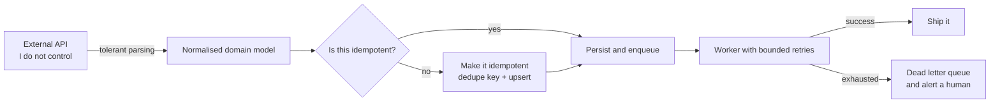

  

  
  
  
  

---

## whoami

I build the unglamorous machinery behind e-commerce: order pipelines, carrier integrations,
warehouse software and the Shopify tooling that sits on top of it. Most of my day is Java and
Spring talking to Postgres, queues and third-party APIs that were never designed to be talked to.

Before commerce I spent my time on the other side of the wire, writing scanners, sniffers and
rogue access points in Python. That habit never really left, and it shows up as a reflex to ask
what happens when a request is malformed, replayed or hostile.

- Backend engineer, currently deep in fulfillment and logistics systems
- Building [Fos Apps](https://fosapps.com), a set of five focused Shopify utilities
- Engineering the software behind [Enretag](https://enretag.com), a US fulfillment operation
- Long-running interest in aviation, which is where the radar above comes from

---

## Live systems

Every six hours a GitHub Action pings the things I run and redraws this board. No third-party
uptime service, just a Python script and a hand-drawn SVG. If something is red, it is genuinely
broken right now.

  

---

## Recent transmissions

<!-- pulse:activity:start -->
- `  1d ago` created branch `feat/jwt-auth-and-listing-analytics` on [`printmomentum_be`](https://github.com/aykutemreyalcin/printmomentum_be)
- `  2h ago` merged pull request #27 in [`printmomentum_fe`](https://github.com/aykutemreyalcin/printmomentum_fe)
- `  2h ago` opened pull request #27 in [`printmomentum_fe`](https://github.com/aykutemreyalcin/printmomentum_fe)
- `  2h ago` merged pull request #24 in [`printmomentum_be`](https://github.com/aykutemreyalcin/printmomentum_be)
- `  2h ago` opened pull request #24 in [`printmomentum_be`](https://github.com/aykutemreyalcin/printmomentum_be)
<!-- pulse:activity:end -->

---

## How I build

The same shape shows up in almost everything I work on: pull orders from somewhere I do not
control, normalise them, make every step replayable, and never lose a package because a carrier
API returned a 500.

  

<b>The principles behind that diagram</b>

 

- **Assume the upstream lies.** Third-party order and carrier APIs change shape without notice,
  so parsing is defensive and unknown fields never crash an import.
- **Every write is replayable.** Imports and label calls carry a dedupe key, because the honest
  answer to "did that request go through?" is usually "maybe".
- **Failures get a destination.** A job that cannot succeed lands somewhere a person will
  actually look, instead of disappearing into a log file.
- **Boring beats clever.** This code runs unattended while a warehouse depends on it.

---

## Stack

**Backend**

**Frontend**

**Commerce**

**Platform**

**Also**

---

## Numbers

The usual hosted stat cards answer with 503s or twenty second timeouts often enough to show up
as a broken image, so this one is generated in this repository straight from the GitHub API.

  

---

## The snake still eats

  <picture>
    <source media="(prefers-color-scheme: dark)" srcset="https://raw.githubusercontent.com/aykutemreyalcin/aykutemreyalcin/output/snake-dark.svg">
    
  </picture>

---

<b>Beyond the code</b>

 

<!--
  Both widgets below are wired up but switched off until the accounts are connected.

  WakaTime : create an account at https://wakatime.com, install the editor plugin, then enable
             Settings > Account > "Display coding activity publicly". Uncomment the block and
             the card starts filling in on its own.

  Spotify  : visit https://spotify-github-profile.kittinan.vercel.app, authorise Spotify, copy
             the uid it hands back and paste it over SPOTIFY_UID below.

-->

Nothing connected yet.

---

## Reach me

- Site: [aykutemreyalcin.com](https://aykutemreyalcin.com)
- Open to interesting backend problems, especially the ones involving other people's APIs

The status board and activity log on this page rewrite themselves from GitHub Actions.
The radar, pipeline and tracking graphics are hand-written SVG, no generators involved.
